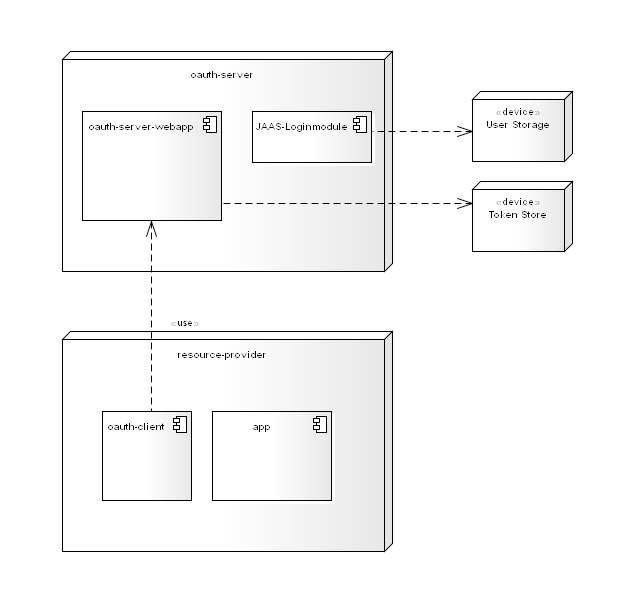

OAUTH2 - COMPONENTS
===================

These components can be used to implement the OAuth2 protocol in JavaEE application servers.
Currently only JBoss EAP 6 is supported, but an adaptation to other servers should be easy.

For [OAuth2](https://tools.ietf.org/html/rfc6749) and [OpenID Connect](http://openid.net/specs/openid-connect-core-1_0.html) protocol itself an [SDK from Nimbus](http://connect2id.com/products/nimbus-oauth-openid-connect-sd) is used. 

For container integration valves and JAAS login modules are currently used, to be more container independent a [JASPIC](https://jaspic-spec.java.net) implementation is provided.

The server and test project using JBoss Arquillian for testing, so that the following artifact in Maven repository is expected:

        <dependency>
          <groupId>org.jboss.as</groupId>
          <artifactId>jboss-eap</artifactId>
          <version>${version.jboss.as}</version>
          <type>zip</type>
        </dependency>

This can be achieved by :

    mvn install:install-file -Dfile=jboss-eap-6.4.0.zip -DgroupId=org.jboss.as -DartifactId=jboss-eap -Dversion=6.4 -Dpackaging=zip

Deployment overview:

oauth-server
============
Endpoints (REST) for OAauth 2 authentification (auth-code and implicit flow) and OpenID Connect userinfo.

- Authentification endpoint: /auth
- Token endpoint (convert auth-grant-code into tokens): /token
- Userinfo endpoint: /userinfo

In order to achieve authorization, these endpoints must be protected during use.

For Token persistence an interface is used, so that the implementation is independent from the concrete persistence mechanism.

oauth-tokenstore-jpa
====================
JPA implementation of the oauth-server token store interface.

oauth-tokenstore-mongodb
====================
Mongo DB implementation of the oauth-server token store interface.

The following properties for database access will be used:

- oauth.mongodb.uri (default: mongodb://localhost:27017)
- oauth.mongodb.database (default: oauth)
- oauth.mongodb.collection (default: tokenstore)

oauth-server-sample
===================
This project demonstrates how to use the oauth2 components.
A secured web application is required to run the OAuth endpoints. 

The oauth-server itselfs requires an concrete token store implementation:

    <artifactId>oauth-server-sample</artifactId>
    <packaging>war</packaging>

    <properties>
        <version.oauth>0.16</version.oauth>
    </properties>

    <dependencies>
        <dependency>
            <groupId>de.adorsys.oauth</groupId>
            <artifactId>oauth-server</artifactId>
            <version>${version.oauth}</version>
        </dependency>
        <dependency>
            <groupId>de.adorsys.oauth</groupId>
            <artifactId>oauth-tokenstore-jpa</artifactId>
            <version>${version.oauth}</version>
        </dependency>
    </dependencies>

To achieve authentication the OAuth endpoints must be protected (web.xml):

    <security-constraint>
        <web-resource-collection>
            <web-resource-name>auth</web-resource-name>
            <url-pattern>/auth</url-pattern>
            <http-method>GET</http-method>
            <http-method>POST</http-method>
            </web-resource-collection>
        <auth-constraint>
            <role-name>oauth</role-name>
        </auth-constraint>
    </security-constraint>
  
    <login-config>
        <realm-name>oauth-server</realm-name>
        <auth-method>BASIC</auth-method>
    </login-config>

With this configuration, authentication is delegated to the application server with his specific settings (login modules, etc).

The oauth-server components themselves using a small part of JBoss specific code to extract the roles for the userinfo endpoint extract.

Attention: JBoss requires an active role for protecting of resources. That is, **all** users must have this role (in this sample 'oauth'). To giva all users this technical role, a simple login module is provided:

    <login-module code="de.adorsys.oauth.server.OAuthRoleLoginModule" flag="optional" />
   

oauth-client-jaas
==================
This JBoss module is for interaction between resource provider (application) and oauth-server.

An authentication valve intercepts requests and performs authentication. 

If the user is not authenticated, an OAuth "authorization code" process is started. The user will be redirected to the OAuth server, and the OAuth server performs authentication through.

If the request contains an oauth bearer token, the token will validated against the oauth-server and the userinfo endpoint is used to obtain user roles.

The authentication valve must be configured in the jboss-web.xml. (It's also possible to declare valves in the jboss configuration, e.g. standalone.xml - except authentification valves ...)

    <jbopss-web>
        <context-root>app</context-root>
        <security-domain>oauth-client</security-domain>
        <valve>
            <class-name>de.adorsys.oauth.client.jaas.OAuthAuthenticator</class-name>
            <module>oauth</module>
            <param>
                <param-name>authEndpoint</param-name>
                <param-value>http://localhost:8180/auth</param-value>
            </param>
            <param>
                <param-name>tokenEndpoint</param-name>
                <param-value>http://localhost:8180/token</param-value>
            </param>
            <param>
                <param-name>userInfoEndpoint</param-name>
                <param-value>http://localhost:8180/userinfo</param-value>
            </param>
            <param>
                <!-- oauth client id -->
                <param-name>clientId</param-name>
                <param-value>sample</param-value>
            </param>
            <param>
                <!-- for legacy code store principal in http session -->
                <param-name>supportHttpSession</param-name>
                <param-value>true</param-value>
            </param>
        </valve>
    </jbopss-web>

Wiht this definiton, the following security domain in the JBoss server definition is required:

    <security-domain name="oauth-client" cache-type="default">
        <authentication>
            <login-module module="oauth" code="de.adorsys.oauth.client.jaas.OAuthLoginModule" flag="required" />
        </authentication>
    </security-domain>

oauth-client-jaspic
===================
This OAuth-client uses an ServletContextListener for self registration of the JASPIC server auth module.

The configuration is taken from the following ServletContext parameters:

    <context-param>
      <param-name>oauth.auth</param-name>
      <param-value>http://localhost:8280/oauth/auth</param-value>
    </context-param>
    <context-param>
      <param-name>oauth.token</param-name>
      <param-value>http://localhost:8280/oauth/token</param-value>
    </context-param>
    <context-param>
      <param-name>oauth.userinfo</param-name>
      <param-value>http://localhost:8280/oauth/userinfo</param-value>
    </context-param>
    <context-param>
      <param-name>oauth.clientId</param-name>
      <param-value>sample</param-value>
    </context-param>
    <context-param>
      <param-name>oauth.supportHttpSession</param-name>
      <param-value>true</param-value>
    </context-param>

For JBoss is the following definition in the jboss-web.xml required:

    <valve>
      <class-name>org.jboss.as.web.security.jaspi.WebJASPIAuthenticator</class-name>
    </valve>

There is no server configuration required.

A good explanation of JASPIC is [here](http://arjan-tijms.omnifaces.org/2012/11/implementing-container-authentication.html).

oauth-test
==========
Provides Arquillian tests for demonstration and a small angular-js web app (based on https://github.com/manfredsteyer/angular-with-openid-connect).
  
  
  
  
  

